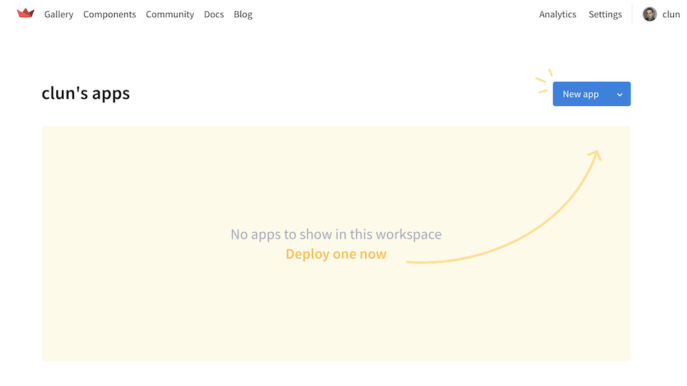
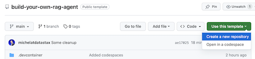
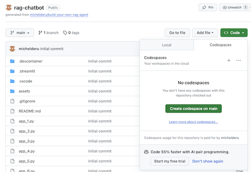
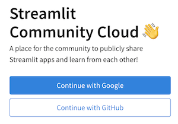
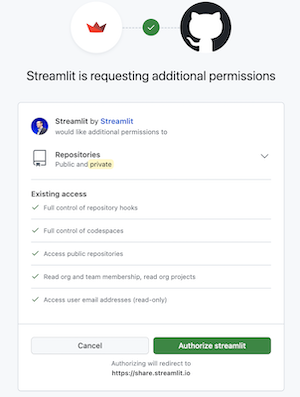

# Build Your Own RAG Chatbot with Langflow

Welcome to this innovative workshop where you will build and deploy your own Chatbot using Retrieval Augmented Generation powered by Astra DB and LangFlow. This session allows you to integrate cutting-edge AI technologies seamlessly, simplifying the development process and enabling you to focus more on creativity and functionality.


**What you'll learn:**
- 🚀 **Advanced Vector Search with Astra DB:** Harness the power of [Astra DB's vector search](https://astra.datastax.com) to enhance chatbot responses.
- 🦜🔗 **Langflow:** Utilize [Langflow](https://www.langflow.com) to bridge LLM models with Astra DB, enabling rapid prototyping and fast path to production.
- 🤖 **Use of OpenAI's Large Language Models:** Explore [OpenAI's language models](https://platform.openai.com/docs/models) for generating natural and relevant chatbot conversations.
- 👑 **Streamlit Deployment:** Learn to deploy your chatbot on the web using [Streamlit](https://streamlit.io), for real-time user interaction.

- Slides of the presentation can be found [HERE](assets/meetups-slides.pdf)

## 1️⃣ Prerequisites
This workshop assumes you have access to:
1. [A Github account](https://github.com)
2. [Google Colab](https://colab.research.google.com/)

During the course, you'll gain access to the following by signing up for free:
1. [DataStax Astra DB](https://astra.datastax.com) (you can sign up through your Github account, in case you have a private Github account sign up with your Google account)
2. [OpenAI account](https://platform.openai.com/signup) (you can sign up through your Github account)
3. [Streamlit](https://streamlit.io) to deploy your amazing app (you can sign up through your Github account)

Follow the below steps and provide the **Astra DB API Endpoint**, **Astra DB ApplicationToken** and **OpenAI API Key** when required.

### Sign up for Astra DB
Make sure you have a vector-capable Astra database (get one for free at [astra.datastax.com](https://astra.datastax.com))
- You will be asked to provide the **API Endpoint** which can be found in the right pane underneath *Database details*.
- Ensure you have an **Application Token** for your database which can be created in the right pane underneath *Database details*.


### Sign up for OpenAI
- Create an [OpenAI account](https://platform.openai.com/signup) or [sign in](https://platform.openai.com/login).
- Navigate to the [API key page](https://platform.openai.com/account/api-keys) and create a new **Secret Key**, optionally naming the key.


### Sign up for Streamlit
Follow the steps outlined [here](https://docs.streamlit.io/streamlit-community-cloud/get-started/quickstart).



## 2️⃣ First try the concepts in a Colab Notebook
To kick this workshop off, we'll first try the concepts in a [Colab Notebook](https://colab.research.google.com/drive/1_n-QZyuP898JNaX7RDnCmw9lkibgEuP-).

This notebook shows the steps to take to use the Astra DB Vector Store as a means to make LLM interactions meaningfull and without hallucinations. The approach taken here is Retrieval Augmented Generation.

You'll learn:

1. About the content in a CNN dataset (we'll use the news article about Daniel Radcliffe in this example)
2. How to interact with the OpenAI Chat Model without providing this context
3. How to load this context into Astra DB Vector Store
4. How to run a semantic similarity search on Astra DB Vector Store
5. How to use this context with the OpenAI Chat Model

[](https://colab.research.google.com/drive/1_n-QZyuP898JNaX7RDnCmw9lkibgEuP-#scrollTo=RUbC-NIgkSR9)


## 3️⃣ Open this tutorial on Github Codespaces
To make life easier, we'll use the awesome Github Codespace functionality. Github offers you a completely integrated developer experience and resources to get started quickly. How?

1. Open the [build-your-own-rag-agent](https://github.com/difli/build-your-own-rag-agent/tree/langflow-openai) repository
2. Click on `Use this template`->`Ceate new repository`. **ENSURE YOU CHECK "Include all branches**:

    

3. Now select your github account and name the new repository. Ideally also set the description. Click `Create repository`

    

4. Cool! You just created a copy in your own Gihub account! **Important: Switch the branch to 'langflow-openai'**

    

5. Now let's get started with coding. Click `Create codespace on langflow-openai` as follows:

    
    
    This will set up your GitHub Codespace environment. It comes fully equipped with everything you'll need for the duration of the workshop. Please allow a few minutes for your environment to be ready.

    

And you're ready to rock and roll! 🥳
As Codespaces creates your dev environment based on `Python 3.10`, it will automatically install the Python dependecies from `requirements.txt`. So, no need to `pip install` anything here. It will also set up port forwarding so you can access subsequent Streamlit apps from anywhere.  
When the codespace start up, it will run a Streamlit Hello World app for you which shows some of the awesome capabilities of this UI framework. When you're done playing, just click `ctrl-c` in the `terminal` to stop running it.

## 4️⃣ Getting started with Streamlit to build an app

Let us now build a real application.

In this workshop we'll use Streamlit which is an amazingly simple to use framework to create front-end web applications.

To get started, let's create a *hello world* application as follows:

```python
import streamlit as st

# Draw a title and some markdown
st.title("Your personal Efficiency Booster")
st.markdown("""Generative AI is considered to bring the next Industrial Revolution.  
Why? Studies show a **37% efficiency boost** in day to day work activities!""")
```
The first step is to import the streamlit package. Then we call `st.title` to write a title to the web page and lastly we write some markdown content to the web page using `st.markdown`.

To get this application started locally you'll need to install the streamlit dependency as follows (not needed in Codespaces):
```bash
pip install streamlit
```

Now run the app:
```bash
streamlit run app_1.py
```

This will start the application server and will bring you to the web page you just created.

Simple, isn't it? 🤩

## 5️⃣ Add a Chatbot interface to the app

In this step we'll start preparing the app to allow for chatbot interaction with a user. We'll use the following Streamlit components:

1. `st.chat_input` in order for a user to allow to enter a question

2. `st.chat_message('human')` to draw the user's input

3. `st.chat_message('assistant')` to draw the chatbot's response

This results in the following code:

```python
# Draw the chat input box
if question := st.chat_input("What's up?"):
    
    # Draw the user's question
    with st.chat_message('human'):
        st.markdown(question)

    # Generate the answer
    answer = f"""You asked: {question}"""

    # Draw the bot's answer
    with st.chat_message('assistant'):
        st.markdown(answer)
```

Try it out using [app_2.py](./app_2.py) and kick it off as follows.  
If your previous app is still running, just kill it by pressing `ctrl-c` on beforehand.

```bash
streamlit run app_2.py
```

Now type a question, and type another one again. You'll see that only the last question is kept.

Why???

This is because Streamlit will redraw the whole screen again and again based on the latest input. As we're not remembering the questions, only the last on is show.

## 6️⃣ Remember the chatbot interaction

In this step we'll make sure to keep track of the questions and answers so that with every redraw the history is shown.

To do this we'll take the next steps:
1. Add the question in a `st.session_state` called `messages`
2. Add the answer in a `st.session_state` called `messages`
3. When the app redraws, print out the history using a loop like `for message in st.session_state.messages`

This approach works because the `session_state` is stateful across Streamlit runs.

Check out the complete code in [app_3.py](./app_3.py). 

As you'll see we use a dictionary to store both the `role` (which can be either the Human or the AI) and the `question` or `answer`. Keeping track of the role is important as it will draw the right picture in the browser.

Run it with:
```bash
streamlit run app_3.py
```

Now add multiple questions and you'll see these are redraw to the screen every time Streamlit reruns. 👍

## 7️⃣ Now for the cool part! Let's get familiar with Langflow 🤖

Start Langflow with:
```bash
python -m langflow run
```
Click the 'Open in Browser' button.


This brings up the Langflow UI.


Click the 'New Project' button.


Select the "Basic Prompting (Hello, World) template.


Isn't that great? That is our first flow. This flow is composed of some Langflow core components, which are connected to each other. It starts with the 'Chat Input' on the left, which flows into the 'Prompt.' The 'Prompt' then flows into the LLM. In this case, it is an OpenAI LLM, but it could also be any other LLM listed under Models on the left-hand side. Finally, the LLM completion goes into the 'Chat Output.'

**Crucial to grasp:** Behind the Langflow components is [Langchain](https://python.langchain.com/docs/get_started/introduction/) code. Langchain is a leading framework for developing applications powered by large language models. Langflow greatly simplifies the development of these applications by offering a no-code development platform that abstracts away the Langchain code with the Langflow components.  

Let's run our Flow in the Langflow UI. Before we do that, we need to provide some additional details. The detail we need is the OpenAI API key. 


First, let's check if the flow is valid. Click the play button in the 'Chat Output' component.


The play buttons of the components should turn into check marks to indicate that the flow is valid.

Let's run the flow with the integrated chat UI in Langflow. Simply hit the 'Run' button.


This opens the interaction panel. Engage in a conversation with your LLM, behaving like a pirate. Feel free to adjust the prompt to see how it changes the LLM's response.


Isn't that incredibly simple? Imagine how this facilitates creativity and the implementation of generative AI applications. You didn’t have to write any code to implement a chatbot using Langflow.

## 8️⃣ Integrate our flow into our Streamlit application.

Now things become really interesting! In this step, we'll integrate the flow into the Streamlit application that we built in the previous sections.

Langflow offers a number of options for integrating flows into applications. We are going to explore two options:
1. Leveraging the Langflow API via REST calls from our application.
2. Embedding Langflow into our application.

We will go for option 1 now but also try option 2 later.

**Important for the next steps:** There are 'app_4_initial.py' and 'app_4_complete.py'. Copy and paste the code provided by the Langflow UI into 'app_4_initial.py', and use 'app_5_complete.py' as a reference to ensure the code is inserted in the correct location within your application.

Click the '</> API' button.


Click the 'Python API' tab.


The provided Python code snippet integrates the chatbot application with Langflow using the REST API. This code enables the sending of chat messages to a specified flow and the retrieval of responses. It imports necessary modules, sets up the base API URL, flow ID, and includes some optional tweaks for the components in the flow.

```python
import requests
from typing import Optional

BASE_API_URL = "https://upgraded-space-waffle-vjp77wr4wqr36wj5-7860.app.github.dev/api/v1/run"
FLOW_ID = "5a56173b-61d6-4f34-a3ec-318df82e3538"
# You can tweak the flow by adding a tweaks dictionary
# e.g {"OpenAI-XXXXX": {"model_name": "gpt-4"}}
TWEAKS = {
  "Prompt-EMif2": {},
  "OpenAIModel-b3rzC": {},
  "ChatOutput-MryQY": {},
  "ChatInput-u0PY2": {}
}

def run_flow(message: str,
  flow_id: str,
  output_type: str = "chat",
  input_type: str = "chat",
  tweaks: Optional[dict] = None,
  api_key: Optional[str] = None) -> dict:
    """
    Run a flow with a given message and optional tweaks.

    :param message: The message to send to the flow
    :param flow_id: The ID of the flow to run
    :param tweaks: Optional tweaks to customize the flow
    :return: The JSON response from the flow
    """
    api_url = f"{BASE_API_URL}/{flow_id}"

    payload = {
        "input_value": message,
        "output_type": output_type,
        "input_type": input_type,
    }
    headers = None
    if tweaks:
        payload["tweaks"] = tweaks
    if api_key:
        headers = {"x-api-key": api_key}
    response = requests.post(api_url, json=payload, headers=headers)
    return response.json()

# Setup any tweaks you want to apply to the flow
message = "message"

print(run_flow(message=message, flow_id=FLOW_ID, tweaks=TWEAKS))
```

Before we continue, we need to provide the OPENAI_API_KEY in ./streamlit/secrets.toml. Rename secrets.toml.example to secrets.toml and enter the credentials:

```toml
# OpenAI secrets
OPENAI_API_KEY = "<YOUR-OPENAI_API_KEY>"
```

Look in `app_4_initial.py` for TODO #1 and:
1. Copy and paste the necessary code from the Langflow Python API tab. Exclude the last two lines of the provided code; these will be used elsewhere.
2. Ensure the `TWEAKS` dictionary is fully configured with all required customizations specific to your flow needs. See `app_4_complete.py` for what TWEAK details need to be configured. Feel free to also play with the prompt template.

Look in `app_4_initial.py` for TODO #2:
1. Invoke the `run_flow` function using the provided question, `flow_id`, and `tweaks`.
2. Capture and process the output to extract the desired result.

And run the app:
```bash
streamlit run app_4_initial.py
```


Wasn't that easy! The chatbot code does not contain any specific generative AI code. This was all accomplished by defining the flow with Langflow. The application leverages the flow, passes the question to it, and the output from the flow is the answer.

## 9️⃣ Implement a Full-Blown Retrieval-Augmented Generation (RAG) Chatbot.

Now things become even more exciting! In this step, we'll implement a full-blown chatbot application that leverages RAG (Retrieval Augmented Generation) to answer questions based on the context we upload into the chatbot.

Before we continue, we need to provide the ASTRA_API_ENDPOINT and ASTRA_TOKEN in ./streamlit/secrets.toml.:

```toml
# Astra DB secrets
ASTRA_API_ENDPOINT = "<YOUR-API-ENDPOINT>"
ASTRA_TOKEN = "<YOUR-TOKEN>"
```

Upload the flows.json file from your repo folder into your Langflow instance.
Click 'Upload Collection' in your Langflow UI.


You should now have the flows 'Chat_app_5' and 'Vectorize_app_5' in your collection.

Our chatbot is based on these two flows. 

- 'Vectorize_app_5' is the flow used to vectorize our context and store it in Astra DB, our vector store. 
  
- Chat_app_5' is the flow through which our question passes to retrieve similar context from the Astra DB vector store and to provide the question and context to the LLM to answer the question.
  

Click on 'Edit Flow' for 'Chat_app_5'.


Click the '</> API' button.


Click the 'Python API' tab.


The provided Python code snippet integrates the chatbot application with Langflow using the REST API. This code enables the sending of chat messages to a specified flow and the retrieval of responses. It imports necessary modules, sets up the base API URL, flow ID, and includes some optional tweaks for the components in the flow.

```python
import requests
from typing import Optional

BASE_API_URL = "http://127.0.0.1:7860/api/v1/run"
FLOW_ID = "589cb5ee-ace6-440d-a885-bc0e9ef41636"
# You can tweak the flow by adding a tweaks dictionary
# e.g {"OpenAI-XXXXX": {"model_name": "gpt-4"}}
TWEAKS = {
  "ChatInput-Ed0w6": {},
  "TextOutput-vVPoH": {},
  "OpenAIEmbeddings-kl45J": {},
  "OpenAIModel-4A6FX": {},
  "Prompt-t8lIV": {},
  "ChatOutput-5ifqe": {},
  "AstraDBSearch-7tbUz": {}
}

def run_flow(message: str,
  flow_id: str,
  output_type: str = "chat",
  input_type: str = "chat",
  tweaks: Optional[dict] = None,
  api_key: Optional[str] = None) -> dict:
    """
    Run a flow with a given message and optional tweaks.

    :param message: The message to send to the flow
    :param flow_id: The ID of the flow to run
    :param tweaks: Optional tweaks to customize the flow
    :return: The JSON response from the flow
    """
    api_url = f"{BASE_API_URL}/{flow_id}"

    payload = {
        "input_value": message,
        "output_type": output_type,
        "input_type": input_type,
    }
    headers = None
    if tweaks:
        payload["tweaks"] = tweaks
    if api_key:
        headers = {"x-api-key": api_key}
    response = requests.post(api_url, json=payload, headers=headers)
    return response.json()

# Setup any tweaks you want to apply to the flow
message = "message"

print(run_flow(message=message, flow_id=FLOW_ID, tweaks=TWEAKS))
```

Look in `app_5_initial.py` for TODO #1 and:
1. Copy and paste the necessary code from the Langflow Python API tab. Exclude the last two lines of the provided code; these will be used elsewhere.
2. Ensure the `TWEAKS` dictionary is fully configured with all required customizations specific to your flow needs. See `app_5_complete.py` for what TWEAK details need to be configured. 

Look in `app_5_initial.py` for TODO #2:
1. Invoke the `run_flow` function using the provided question, `flow_id`, and `tweaks`.
2. Capture and process the output to extract the desired result.

Let's integrate the next flow. Click on 'Edit Flow' for 'Vectorize_app_5' in the 'My Collection' view.


Click the '</> API' button.


Click this time the 'Python Code' tab.


The provided Python code snippet embeds the chat flow directly into our chatbot application. This code facilitates the sending of chat messages to the chat flow, imports necessary modules, and includes some optional tweaks for the components in the flow.

```python
from langflow.load import run_flow_from_json
TWEAKS = {
  "File-hx9qW": {},
  "RecursiveCharacterTextSplitter-JNwYQ": {},
  "AstraDB-2HgLU": {},
  "OpenAIEmbeddings-qgFd2": {}
}

result = run_flow_from_json(flow="Vectorize_app_5.json",
                            input_value="message",
                            tweaks=TWEAKS)
```

Look in `app_5_initial.py` for TODO #3 and:
1. Copy and paste the necessary code from the langflow "Python Code" tab for the Flow: "Vectorize_app_5". Ensure to exclude the last two line of the provided code; these will be placed in a different section.
2. Rename 'TWEAKS' to 'VECTORIZE_TWEAKS' dictionary with all required customizations specific to your flow needs. Ensure that API keys and endpoints in 'VECTORIZE_TWEAKS' are updated according to your environment.

Look in `app_5_initial.py` for TODO #4:
1. Verify that the 'File-hx9qW' key exists in the 'VECTORIZE_TWEAKS' dictionary.
2. Copy and paste the necessary code from the langflow "Python Code" tab for the Flow: "Vectorize_app_5".

And run the app:
```bash
streamlit run app_5_initial.py
```


Wasn't that easy! The chatbot code does not contain any specific generative AI code. This was all accomplished by defining the flow with Langflow. The application leverages the flow, passes the question to it, and the output from the flow is the answer.


## 1️⃣0️⃣ Now let's make magic happen! 🦄


## 1️⃣1️⃣ Let's deploy this cool stuff to Streamlit cloud!
In this step we'll deploy your awesome app to the internet so everyone can enjoy your cool work and be amazed!

### Set up your Streamlit account
If you have not do so before, please set up your account on Streamlit. When you already have an account skip to the next step and deploy the app.

1. Head over to [Streamlit.io](https://streamlit.io) and clikc `Sign up`. Then select `Continue with Github`:

    

2. Log in using your Github credentials:

    

3. Now authorize Streamlit:

    

4. And set up your account:

    

### Deploy your app

On the main screen, when logged in, click `New app`.

1. When this is your first deployment, provide additional permissions:

    

2. Now define your application settings. Use YOUR repository name, and name the Main file path as `app_7.py`. Pick a cool App URL as you'll app will be deployed to that:

    

3. Click on Advanced, select Python 3.11 and copy-paste the contents from your `secrets.toml`.

Click Deploy! Wait for a bit and your app is online for everyone to use!

⛔️ Be aware that this app is public and uses your OpenAI account which will incur cost. You'll want to shield it off by clicking `Settings->Sharing` in the main screen and define the email addresses that are allowed access. In order to enable this, link your Google account.

# Python environments
In case you want to run all of the above locally, it's useful to create a *Virtual Environment*. Use the below to set it up:
```
python3 -m venv myenv
```
Then activate it as follows:
```
source myenv/bin/activate   # on Linux/Mac
myenv\Scripts\activate.bat  # on Windows
```
Now you can start installing packages:
```
pip3 install -r requirements.txt
```
In order to check which packages have been installed:
```
pip3 freeze
```
Which you can save to requirements.txt if you want:
```
pip3 freeze > requirements.txt
```
